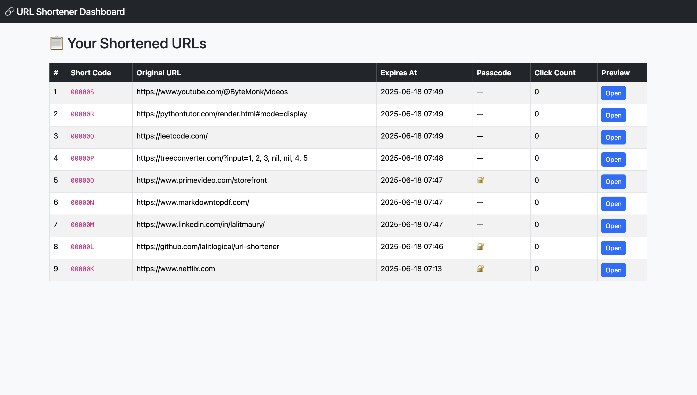

# 🔗 Rails URL Shortener

A secure, scalable, and production-ready **URL Shortener** built with **Ruby on Rails**, **Redis**, and **Sidekiq** — supporting 🔐 passcode protection, 🧠 analytics, and 🚫 brute-force prevention.

---

## 🌐 What is a URL Shortener?

A **URL shortener** is a service that converts long, unreadable URLs into short, memorable aliases — like:

https://example.com/blog/posts/how-to-install-rails → http://sho.rt/abc123

It also optionally tracks **analytics**, supports **password protection**, and enables **link expiry** or one-time use.

---

## 🧩 Real-World Use Cases

| Use Case                  | Description |
|--------------------------|-------------|
| 📱 Shareable Links        | On social media, SMS, or marketing campaigns |
| 🔐 Secure Sharing         | With password/passcode or expiration |
| 🧠 Analytics Tracking     | Clicks, referrers, devices |
| 🎯 A/B Testing            | Route traffic using different links |
| 🧪 One-Time Use URLs      | Self-destructing or private link access |

Used by companies like **Bitly**, **Google**, **Amazon**, **LinkedIn**, and **marketing teams worldwide**.

---

## 🚀 Features

- ✅ Base62 short code generator with Redis atomic counter
- ✅ Passcode-protected URLs
- ✅ Expiration support (`expiration` timestamp)
- ✅ Click tracking (IP, user-agent, referer)
- ✅ Rate limiting on failed passcode attempts (Redis)
- ✅ Redis caching for fast redirection
- ✅ Background jobs using Sidekiq

---

## ⚙️ Tech Stack

- **Ruby on Rails (API mode)**
- **PostgreSQL**
- **Redis**
- **Sidekiq** for background jobs
- **SecureRandom + Base62** short code generator
- Optional: **Devise** for user-scoped short URLs

---

## 🛠 Setup Instructions

### 1. 📦 Clone and Install

```bash
git clone https://github.com/lalitlogical/url-shortener
cd url-shortener
bundle install
```

### 2. 🧱 Setup DB and Redis

Ensure PostgreSQL and Redis are running:

```bash
rails db:create db:migrate
brew services start redis  # or use Docker
```

### 3. 🚦 Start the App

```bash
rails server
```

In another tab, start Sidekiq:

```bash
bundle exec sidekiq
```

### 4. 🧪 Test with Curl

🔗 Create a Short URL

```bash
curl -X POST http://localhost:3000/shortened_urls \
  -H "Content-Type: application/json" \
  -d '{
    "shortened_url": {
      "original_url": "https://www.netflix.com",
      "expiration": 1750224987,
      "passcode": "secret123"
    }
  }'
```

### ↪️ Access the Short URL

```bash
curl http://localhost:3000/abc123?passcode=secret123
```

## 📸 Screenshots

### 🔗 Dashboard View



The dashboard provides a clean, tabular interface to view all shortened URLs created in the system. Each row displays:

- The short code generated (e.g., `abc123`)
- The original long URL
- Expiration time (if set)
- Whether the link is passcode protected
- Number of times the link has been clicked
- A direct preview button to open the shortened URL (with passcode hint if needed)

This makes it easy to manage and monitor link activity without needing API calls or external tools.

## 🛡️ Security Considerations

| Concern                | Implementation |
|------------------------|----------------|
| 🔐 Passcode Protection  | `has_secure_password` using `passcode_digest` |
| 🚫 Brute-force attacks  | Rate-limited with Redis per-IP per-code |
| 📉 Expired Links        | Automatically filtered in `ShortenedUrl.active` scope |
| 🔁 Unique Codes         | Ensured by Redis + Base62 + DB constraint |
| ⏱ Link Expiry Support  | Timestamp-based, auto-filtered |

## 🧠 Developer Notes

URL Generation Logic
Located in: lib/base62_short_code_generator.rb

- Uses Redis INCR for collision-free IDs
- Encodes as Base62 (0-9, a-z, A-Z)
- Fallbacks to UUID if Redis fails

Passcode Protection

- Optional per URL
- Stored using BCrypt
- Access requires valid passcode via GET ?passcode=...

Rate Limiting (per IP per URL)

- Redis key: passcode:fail:<short_code>:<ip>
- Max 5 attempts per 10 minutes
- Automatic reset on success

## 📸 Sample Response

```json
{
  "short_url": "http://localhost:3000/abc123",
  "passcode_protected": true
}
```

## 📅 Roadmap / Ideas

- 🔐 OAuth login & user dashboards
- 📊 Analytics dashboard with charts
- 🧾 QR Code generation
- 🕓 Scheduled auto-deactivation
- 💬 Slack/Telegram integration

## 👨‍💻 Author

Made with ❤️ by @lalitlogical

## 📜 License

MIT – feel free to fork, extend, and improve!